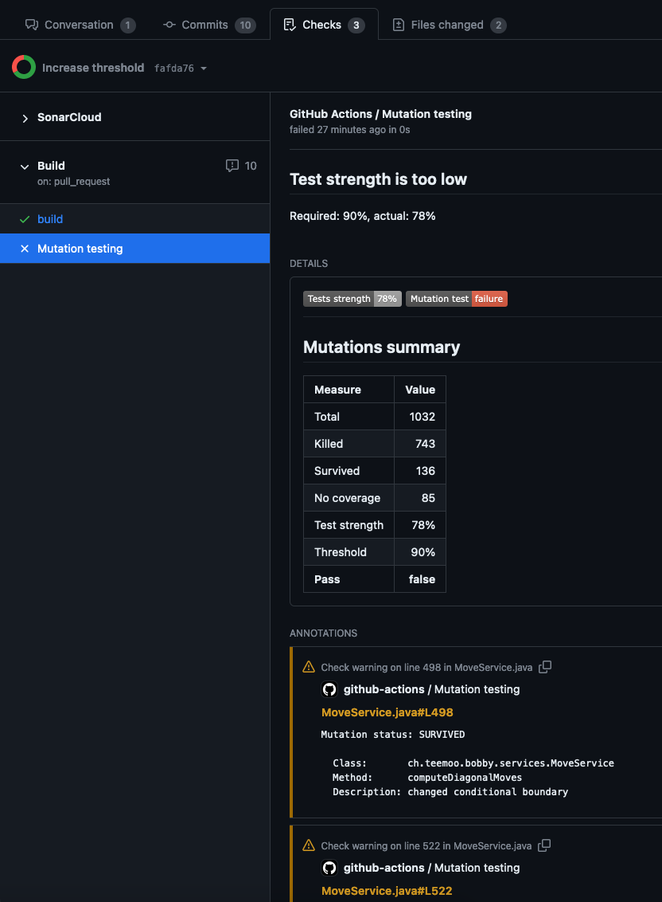

# Mutation Testing - Report - Action

[](https://github.com/teemoo7/mutation-testing-report-action/actions/workflows/build.yml)
[](https://sonarcloud.io/summary/new_code?id=teemoo7_mutation-testing-report-action)
[](https://sonarcloud.io/summary/new_code?id=teemoo7_mutation-testing-report-action)
[](https://github.com/prettier/prettier)

This GitHub Action reads mutation testing report generated by tools like [Pitest](https://pitest.org/) (XML)
or [Stryker Mutator](https://stryker-mutator.io/) and creates a check with annotations.

## Permissions

The workflow executing the action must have the following permission: `checks:write`.

## Inputs

- `xml-report-path`
- `threshold`
- `fail-workflow`
- `max-annotations`
- `token`

### `xml-report-path`

**Optional** The location of Pitest XML report

Default value is `target/pit-reports/mutations.xml`.

### `threshold`

**Optional** The test strength threshold to reach, in percent. If the threshold is explicitly given as `0`, check will
always pass (no failure).

Default value is `80`.

### `fail-workflow`

**Optional** If enabled, when the test strength is not matching the threshold, the workflow step will be marked as
failure.

Default value is `false`.

### `max-annotations`

**Optional** The maximal number of annotations that will be created (one for each undetected mutation). GitHub API
allows at most 50 annotations.

Default value is `5`

### `token`

**Optional** The GitHub token allowing to call GitHub REST API to create checks (needs `write` permission). It is
recommended to use the default value, which is the auto generated token for the workflow.

Default value is `${{ github.token }}`.

## Outputs

- `test-strength`
- `result`

### `test-strength`

The value of test strength (in percent) computed by the mutation test tool.

### `result`

The result of the comparison between test strength and threshold. Values can be `success` or `failure`.

## Check

A check is created to say whether the minimal threshold is reached for test strength.

## Example usages

### Default (minimal)

```yaml
uses: teemoo7/mutation-testing-report-action@v1
```

### Custom

```yaml
uses: teemoo7/mutation-testing-report-action@v1
with:
  xml-report-path: 'target/reports/pit/mutations.xml'
  threshold: '75'
  fail-workflow: true
  max-annotations: '10'
```

## Limitations

- Only Pitest is supported for now, with XML reports.
- Unfortunately, Pitest report does not provide the full path of files, only the filename. Because of this, annotations
  links are not fully working.

## Preview



## Local setup

### Install dependencies

```shell
npm ci
```

### Run linter

```shell
npm run lint
```

### Run Prettier

To check all files (without changing them):

```shell
npx prettier --check .
```

To apply formatting changes:

```shell
npx prettier --write .
```

### Run unit-tests

```shell
npm test
```
